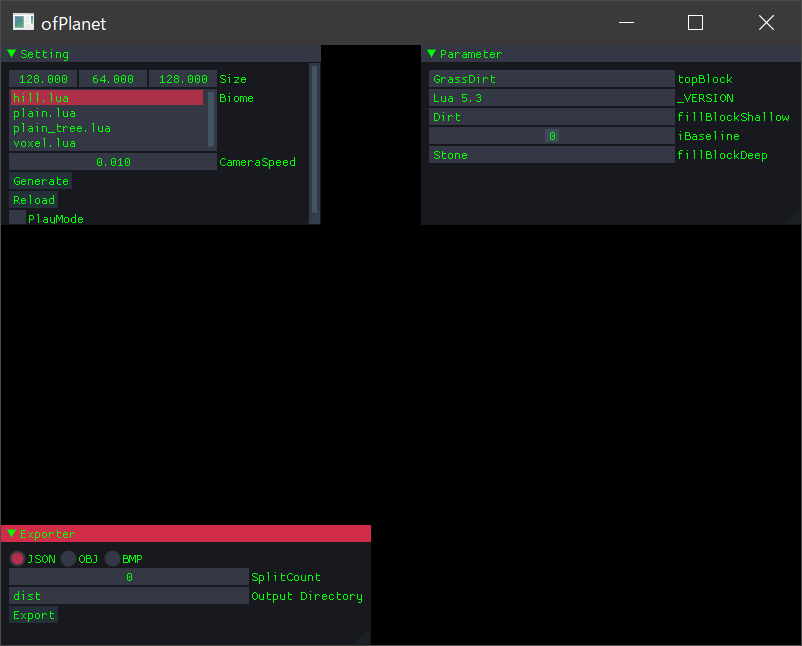
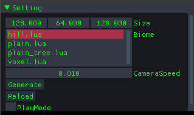
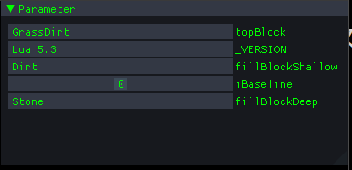

# ofPlanetユーザーマニュアル
ofPlanetは地形生成エディターです。

# 動作環境
このアプリケーションはVisualStudio2017を用いて実装されました。  
[VisualStudio2017再頒布パッケージ](https://support.microsoft.com/ja-jp/help/2977003/the-latest-supported-visual-c-downloads)が必要です。

## 起動
`Runtime/ofPlanet.exe`をダブルクリックして起動します。  
Runtimeフォルダには `block.json` `textures.json` が必要です。  
他にもブロックのための画像が必要ですが、これは任意の自由なディレクトリに配置できます。  
※ただし、サブディレクトリを作ることはできません。全て直下に配置します。

このアプリには最初から `Runtime/blocks.json` `Runtime/textures.json` そしてテクスチャが `Runtime/data/block` に格納されているので、  
何もしなくても起動することができるはずです。

## 画面
起動すると、以下のような画面が表示されるはずです。


### Setting
ワールドの基本的な設定を定義します。  


#### Size
生成するワールドのサイズを設定出来ます。
#### Biome
生成するワールドの種類を決めます。  
これは `Runtime/data/script` の中に配置されたLuaスクリプトで実装されており、
ユーザーが自由に追加可能です。
#### CameraSpeed
プレビュー時のカメラ速度です。
#### PlayMode
ONにすると、WASDと矢印キーでワールドを移動出来ます。

### Parameter
これはUnityにおける`SerializedField`と同じような働きをします。  
現在選択されているLuaスクリプトのグローバル変数を全て表示します。  


例えば、以下のスクリプトでは最初の四行で変数を宣言し、初期値を与えています。  
この変数を編集するための適切なエディターを表示しているのが上記の画像です。  
選択中のスクリプトが切り替われば自動で切り替わります。
````
topBlock = "GrassDirt"
fillBlockDeep = "Stone"
fillBlockShallow = "Dirt"
iBaseline = 0

function getCallbackMode()
    return "default"
-- return "ignore"
end

function onFixHeight(y)
    if(y < iBaseline) then
        return iBaseline;
    end
    return y;
end

function onGenerateTerrain(x, y, z)
    startY = y
    setblock(x, y, z, topBlock);
    while y > 0 do
        y = y - 1
        if y < (startY - 5) then
            setblock(x, y, z, fillBlockDeep)
        else
            setblock(x, y, z, fillBlockShallow)
        end
    end
end

function onGenerateWater(x, y, z)
    setblock(x, y, z, "Water");
end

function onGenerateStructures()
end

function onGenerateCave(x, y, z, noise)
    if(noise > 0.1) then
        setblock(x, y, z, "");
    end
end

function onPostGenerate()
    print("done.")
end
````

## textures.json
textures.jsonは例えば以下のようなファイルです。
````
{
  "baseDirectory": "./data/image/block",
  "textures": [
    {
      "baseFileName": "DirtBlock",
      "mappingRule": {
        "all": "Side"
      },
      "reference": "DirtBlock"
    }
    以下略...
}
````
### baseDirectory
テクスチャが格納されるディレクトリを指定します。
### textures
この配下にテクスチャ定義を並べます
### baseFileName
テクスチャのベースとなるファイル名です。  
ブロックは6個の面から構成されますが、  それぞれのファイルに共通する部分をここに定義します。  
例えば、6個の面を構成するテクスチャが
* `Dirt_Top.png`
* `Dirt_Bottom.png`
* `Dirt_Left.png`
* `Dirt_Right.png`
* `Dirt_Front.png`
* `Dirt_Back.png`

であるとき、共通部分は `Dirt_` です。  
これに後述する `mappingRule` をつけたすことで面ごとのテクスチャのファイル名を解決します。

### mappingRule
マッピングルールはある面に対応するファイルの名前です。  
キーには `"all" "top" "bottom" "left" "right" "front" "back"` が使えます。  
ただし、6個の面全てが埋められていれば全てのキーを使う必要はありません。  
例えば、ベース名が `"baseFileName": "Dirt"` のように定義されていて、  
マッピングルールが `"all": "Side"` のように定義されているなら、
全ての面に `DirtSide.png` が適用されることになります。  
これは6個の面のうちいくつかの面のテクスチャが使い回されるときに便利です。  

また、`"all"`と他の面が同時に定義されている場合、  
一度 `"all"` で全ての面を解決したあとで、定義されている他の面を使ってもう一度テクスチャのファイルを解決します。(上書き)  
なので、部分的にテクスチャを使い回すことも可能です。

### reference
リファレンスは、このテクスチャのセット自体に一意な名前をつけるために必要です。  
`blocks.json`からテクスチャを指定するときはこの名前を使用します。

## blocks.json
blocks.jsonは例えば以下のようなファイルです。
````
{
  "blocks": [
    {
      "reference": "Dirt",
      "texture": "DirtBlock"
    },
    以下略...
}
````

### reference
このブロックを参照するための名前を定義します。  
これはLuaスクリプト内部から使用されます。(後述)

### texture
対応するテクスチャを定義します。
上述の `textures.json` の `reference` に定義した名前を使用します。

### textures.json & blocks.json
この2つのファイルが間接参照を多用したデータ構造になっているのは意図的なものです。  
テクスチャのみ/ブロックのみをあとから簡単に差し替えることが可能です。

### Exporter
生成した地形を任意の他のプログラムで利用するために、  
エクスポートするためのウィンドウです。  
メニューだけ用意されてますが、まだJSONにしか対応していません。


# 開発者マニュアル
## Luaスクリプト
原則として、luaスクリプトは全て `Runtime/data/script` に配置します。  
※ `ofPlanet.exe` が `Runtime` にあるとする

[LUA Manual](https://www.lua.org/manual/5.3/)

### コールバック関数
内部的には、C++からLuaで定義された各種コールバック関数を呼び出すことで地形を生成します。  
パーリンノイズ生成などの定型的な処理は全てC++側で処理されます。  
LuaでやるべきことはC++から受け取ったノイズ(実数型)を使用して地形を生成することと、  
必要に応じて任意の構造物などを生成することです。  

#### getCallbackMode -> mode
スクリプトで記述するアルゴリズムに応じてコールバックの種類を決めます。  
* "default"
    * 全てのコールバックを呼び出します。
* "ignore"
    * onPostGenerateだけを呼び出します。

#### onFixHeight(y) -> y
y: -1 ~ 1 で表される2Dノイズ  
パーリンノイズ2Dで生成されたy座標を必要ならフィルタできます。

#### onGenerateTerrain(x, y, z) -> void
x, y, z: 生成先の座標  
地表にブロックを配置します。

#### onGenerateWater(x, y, z) -> void
x, y, z: 生成先の座標  
水を生成します。

#### onGenerateStructures() -> void
構造物を生成します。

#### onGenerateCave(x, y, z, noise) -> void
x, y, z: 生成先の座標  
noise: -1 ~ 1 で表される3Dノイズ  
洞窟を生成します。

#### onPostGenerate -> void
一番最後に呼び出されるコールバックです。

### 関数

#### setblock(x, y, z, name)
指定座標のブロックを設定します  
nameが空文字列""のとき、指定位置のブロックを削除します

#### getblock(x, y, z) -> name
指定座標のブロックを返します

#### getxsize() -> xsize
ワールドのX方向のサイズを返します

#### getysize() -> ysize
ワールドのY方向のサイズを返します

#### getzsize() -> zsize
ワールドのZ方向のサイズを返します

### その他

#### ブロックを指定する方法
`blocks.json`に定義されているブロックの `reference` 属性と同じ名前を使用してください。

#### 数値型
Luaには実数型と整数型の区別がありません。  
しかし、Luaのある変数が整数(integer)として使用されることが想定されているなら、  
`ofPlanet`はその変数に対して小数部分を編集できないエディターを提供するべきです。  
この区別をつけるため、`ofPlanet`は変数名にプレフィックス`i`のついた変数を特別扱いします。  
`i`が付く場合には小数部分を編集できないスライダーUIを提供し、それ以外の場合では小数部分まで編集できてしまうスライダーUIを提供します。

## JSONフォーマット
出力して得られるJSONファイルの形式
````
{
    "cell": [
        {
            "block": "Stone",
            "x": 0,
            "y": 0,
            "z": 0,
        }
        このような定義がブロックの数だけ続く...
    ],
    "worldSize": {
        "x": 128,
        "y": 64,
        "z": 128,
    }
}
````

## 外部プログラムとの連携
様々なバックエンドで地形を利用可能にするため、  
`ofPlanet`は特定のプラットフォームやフレームワークに依存した形式の出力を行いません。  
代わりに、`ofPlanet`を利用するユーザは適切に出力をパースする必要があります。  
現在のところ、`ofPlanet`に対応したバックエンドの一つとして、`uniPlanet`を提供しています。

[uniPlanet](https://github.com/desktopgame/uniPlanet)

# ライセンス
このアプリケーションは以下のライブラリを使用して実装されました。
* [openframeworks](https://openframeworks.cc/ja/)
* [soil](https://www.lonesock.net/soil.html)
* [lua](https://www.lua.org/) 
* [thelink2012/any](https://github.com/thelink2012/any/blob/master/any.hpp)
* [kazuho/picojson](https://github.com/kazuho/picojson)
* [mapbox/variant](https://github.com/mapbox/variant)
* [Reputeless/PerlinNoise](https://github.com/Reputeless/PerlinNoise)