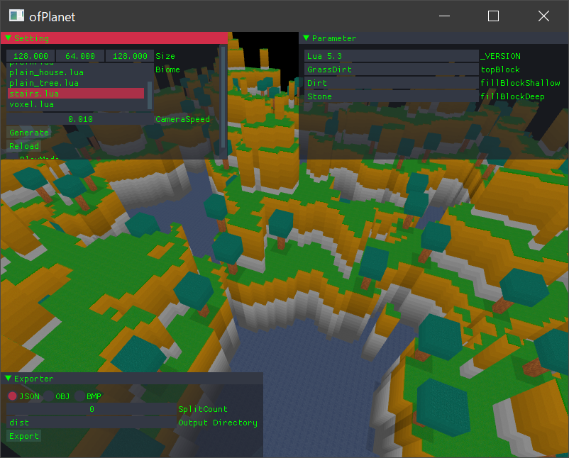
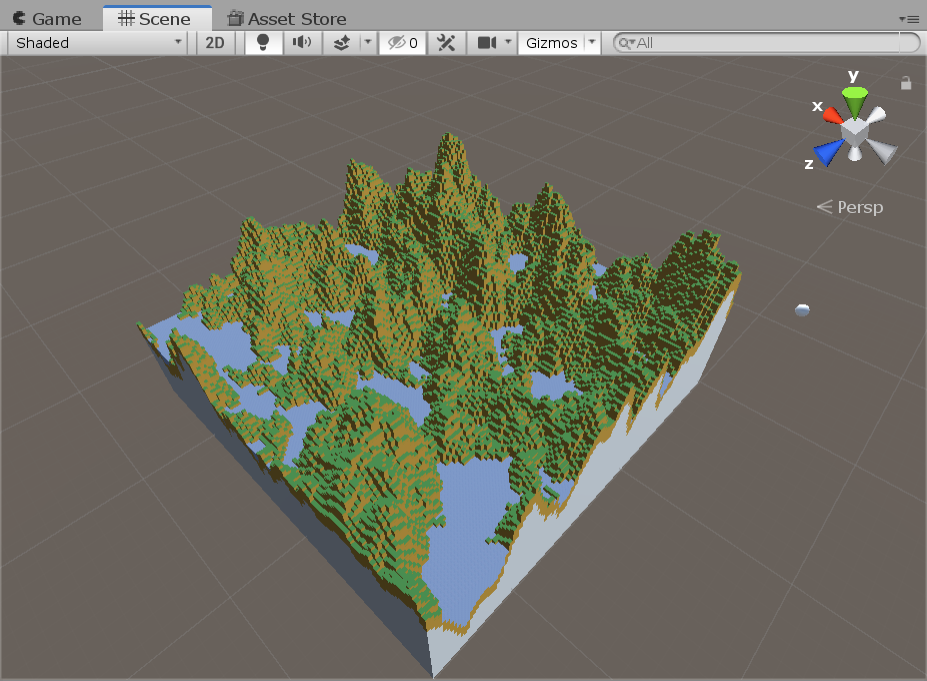

# ofPlanet User's Manual
ofPlanet is terrain generator.



can model export in obj format, can useable in other applications.  
in now, verified confirmed readable in Unity.


# Operating Enviroment
this application was developed in Visual Studio 2017.  
need ["VisualStudio Redistribution Package"](https://support.microsoft.com/en-us/help/2977003/the-latest-supported-visual-c-downloads) for run a ofPlanet.

## Launch
double click to `Runtime/ofPlanet.exe` for launch.  
need `blocks.json` and `textures.json` in `Runtime/data` folder.  
other, need images for blocks, it is locatable for subordinate on data folder.  

in defaults, because already prepared `Runtime/data/blocks.json`, `Runtime/data/textures.json` and images for blocks,  
should be able to launch for only double click.

## Screen Image
launch application and should be able to display like bellow image.


### Setting
input basic setting for world.


#### Size
Size is configure world size.
#### Biome
Biome is configure world biome.  
because  implemented by lua script, users can add new biome.  
details is see `Runtime/data/script` folder.
#### CameraSpeed
CameraSpeed is camera spped on preview.
#### PlayMode
PlayMode is if toggled on, will able move by WASD key.

### Parameter
Parameter is like "SerializedField" on Unity.
editable to variable of current selected lua script.


for example, below script is declare variable in first four line.
above image is shown editor for this variable.
editor is auto updated if changed script.
````
topBlock = "GrassDirt"
fillBlockDeep = "Stone"
fillBlockShallow = "Dirt"
iBaseline = 0

function start()
    return "default"
-- return "ignore"
end

function onFixHeight(y)
    if(y < iBaseline) then
        return iBaseline;
    end
    return y;
end

function onGenerateTerrain(x, y, z)
    startY = y
    setblock(x, y, z, topBlock);
    while y > 0 do
        y = y - 1
        if y < (startY - 5) then
            setblock(x, y, z, fillBlockDeep)
        else
            setblock(x, y, z, fillBlockShallow)
        end
    end
end

function onGenerateWater(x, y, z)
    setblock(x, y, z, "Water");
end

function onGenerateStructures()
end

function onGenerateCave(x, y, z, noise)
    if(noise > 0.1) then
        setblock(x, y, z, "");
    end
end

function onPostGenerate()
    print("done.")
end
````

## textures.json
textures.json is like bellow.
````
{
  "baseDirectory": "image/block",
  "textures": [
    {
      "baseFileName": "DirtBlock",
      "mappingRule": {
        "all": "Side"
      },
      "reference": "DirtBlock"
    }
    ...
}
````
### baseDirectory
baseDirectory is directory for put on textures.
### textures
textures is array for texture definition.
### baseFileName
baseFileName is base of texture name.
because block is structured six side plane, need each sides resolve texture.
for example, baseFileName of texture list bellow is `Dirt_`.
* `Dirt_Top.png`
* `Dirt_Bottom.png`
* `Dirt_Left.png`
* `Dirt_Right.png`
* `Dirt_Front.png`
* `Dirt_Back.png`

resolve by add `mappingRule` to this string.

### mappingRule
mappingRule is define texture bound sides plane.  
useable keys is next: "all", "top", "bottom", "left", "right", "front", "back"

### reference
reference is define name of texture set.

## blocks.json
blocks.json is like bellow.
````
{
  "blocks": [
    {
      "reference": "Dirt",
      "texture": "DirtBlock"
    },
    以下略...
}
````

### reference
reference is define name of block.

### texture
texture is define texture set for corresponding to block.

### shape
omitted in above examples, can specificate block shapes.  
in now, supported half block like minecraft.  
not only, Y axis half block, can create X axis half block and Z axis half block.  
using default block shape if omitt shape property.  
bellow is example for define shape.

````
......
    {
      "reference": "StoneTopSlab",
      "texture": "StoneBlock",
      "shape": "TopSlab"
    },
    {
      "reference": "StoneBottomSlab",
      "texture": "StoneBlock",
      "shape": "BottomSlab"
    },
    {
      "reference": "StoneLeftSlab",
      "texture": "StoneBlock",
      "shape": "LeftSlab"
    },
    {
      "reference": "StoneRightSlab",
      "texture": "StoneBlock",
      "shape": "RightSlab"
    },
    {
      "reference": "StoneFrontSlab",
      "texture": "StoneBlock",
      "shape": "FrontSlab"
    },
    {
      "reference": "StoneBackSlab",
      "texture": "StoneBlock",
      "shape": "BackSlab"
    },
......
````

### textures.json & blocks.json
translate at later, because this section is not so important.  
この2つのファイルが間接参照を多用したデータ構造になっているのは意図的なものです。  
テクスチャのみ/ブロックのみをあとから簡単に差し替えることが可能です。

### Exporter
Exporter is window for export terrain.
in now, supported .bmp, .json and .obj.


# Developer's Manual
## Build
need openFrameworks for build this project.   
and, this project must be located on bellow directory.
````
your_dir/of_v0.10.1_vs2017_release/apps/myApps/ofPlanet
````

and, need next addons:
* [ofxLua](https://github.com/desktopgame/ofxLua)
* [ofxSOIL](https://github.com/desktopgame/ofxSOIL)
* [ofxPlanet](https://github.com/desktopgame/ofxPlanet)


and, need "lua.dll" for "ofPlanet\\bin".  
will auto installed lua at opened this project by nuget.  
will installed "lua.dll" is  together at this time.  
must be this "lua.dll" is copy to "ofPlanet\\bin".

## Lua Script
in principle, all lua script is put on `Runtime/data/script`.
* if you have ofPlanet.exe is located on `Runtime`

[LUA Manual](https://www.lua.org/manual/5.3/)

### Callback Functions
in internal, generate terrain by call lua from C++.  
however, stylized processes is execute on C++.  
example, perlin noise generation... binding block to texture...  
what to do on lua script side is bellow list.  
* filtering noise value.
* put blocks using noise value.
* generate structures using weighting table.
* generate caves using noise value.

#### start -> mode
write initialize code in this function.  
only once called on terrain generation.  

also, should be return either value.
* "default"
  * call all callback functions.
* "ignore"
  * call "onPostGenerate" only.

#### onFixHeight(y) -> y
y: noise value. biger than -1 and smaller than 1.   
will called in each XZ point, filtering noise value.

#### onGenerateTerrain(x, y, z) -> void
x, y, z: destination point.
called on each XZ points, after filter a noise.  
put ground surface blocks.

#### onGenerateStructures() -> void
called on after "onGenerateTerrain".  
generate structure if needed.

#### onGenerateCave(x, y, z, noise) -> void
x, y, z: destination point.
noise: noise value. biger than -1 and smaller than 1.   
called on after "onGenerateStructures".  
generate cave if needed.

#### onPostGenerate -> void
called on end of terrain generation.

### Function

#### setblock(x, y, z, name)
overwrite block in specific point.  
delete block if block name is "".

#### putblock(x, y, z, name)
put block if nothing block on point.  

#### getblock(x, y, z) -> name
returns block located on point.  

#### setblockrange(minX, minY, minZ, maxX, maxY, maxZ, name)
fill to range using block.  

#### putblockrange(minX, minY, minZ, maxX, maxY, maxZ, name)
fill to range using block.  
however, skip if already existing block.

#### replaceblockrange(minX, minY, minZ, maxX, maxY, maxZ, oldName, newName)
replace blcok in range.  

#### getxsize() -> xsize
returns X axis in world size.

#### getysize() -> ysize
returns Y axis in world size.

#### getzsize() -> zsize
returns Z axis in world size.

#### newstruct(name, format)
指定の形状の構造物を文字列nameに紐づけて登録します。  
以下に例を示します。

````
function start()
    newstruct("AAA",[[
,,
,Wood,
,,

,,
,Wood,
,,

,,
,Wood,
,,

,,
,Wood,
,,

Leaf,Leaf,Leaf
Leaf,Leaf,Leaf
Leaf,Leaf,Leaf

Leaf,Leaf,Leaf
Leaf,Leaf,Leaf
Leaf,Leaf,Leaf

Leaf,Leaf,Leaf
Leaf,Leaf,Leaf
Leaf,Leaf,Leaf
]]) 
    return "default"
-- return "ignore"
end
````

※木を構造物として登録するサンプル  
１つの文字列の中に複数のCSVを格納するようなイメージです。空行がCSV間の区切りとなります。  
下に定義されたものほど実際に構造物を生成したときに上の方(+Y)に生成されます。  
また、指定されるブロック名は `blocks.json` の `reference` と同じ名前である必要があります。  
なにもない場合は `,,` のように隙間をあけずにカンマを打てばOKです。

#### genstruct(addWeight, limitWeight, name)
重み付けを使用して構造物を複数配置します。  
重み付けが強ければ強いほど配置数は少なくなります。

#### expandstruct(x, y, z, name)
指定の座標に構造物を配置します。

#### setweight(x, y, z, weight, name)
指定の構造物を配置するための重み付けテーブルの指定の座標の重み付けを上書きします。

#### getweight(x, y, z, name)
指定の構造物を配置するための重み付けテーブルの指定の座標の重み付けを返します。

#### setweightrange(minX, minY, minZ, maxX, maxY, maxZ, weight, name)
指定の構造物を配置するための重み付けテーブルの指定の座標の重み付けを範囲ごと上書きします。

### その他

#### ブロックを指定する方法
`blocks.json`に定義されているブロックの `reference` 属性と同じ名前を使用してください。

#### 数値型
Luaには実数型と整数型の区別がありません。  
しかし、Luaのある変数が整数(integer)として使用されることが想定されているなら、  
`ofPlanet`はその変数に対して小数部分を編集できないエディターを提供するべきです。  
この区別をつけるため、`ofPlanet`は変数名にプレフィックス`i`のついた変数を特別扱いします。  
`i`が付く場合には小数部分を編集できないスライダーUIを提供し、それ以外の場合では小数部分まで編集できてしまうスライダーUIを提供します。

### 重み付けのアルゴリズム
v0.3からは、重み付けによる構造物の生成がサポートされるようになりました。  
構造物を生成できる場所を検索するときに、ただ単にブロックがそこにあるかどうかだけでなく、  
その座標の重み付けがしきい値を超えるかどうかも加味して検索します。  
例えば、構造物を配置することができる十分なスペースがあって、構造物を生成したときに  
構造物と重なるブロックが１つも存在しなくても、その座標の重み付けが十分に高いと生成できないと判断されます。  

重み付けのテーブルは構造物が生成されたときに自動的に構造物を配置した中心から放射状に拡散します。  
つまり、強い重み付けを与えて構造物を生成すればその構造物の生成頻度を下げることができます。  
ofPlanetでは構造物それぞれが内部的に別々の重み付けテーブルを持っているので、  
ある構造物Aの生成によって別の構造物Bの生成頻度が下がることはありません。  

また、構造物を生成せずとも重み付けを操作できる関数を用意しています。  
これを使えば高いところだけ構造物を少なくすることも可能です。

## JSONフォーマット
出力して得られるJSONファイルの形式
````
{
    "cell": [
        {
            "block": "Stone",
            "x": 0,
            "y": 0,
            "z": 0,
        }
        このような定義がブロックの数だけ続く...
    ],
    "worldSize": {
        "x": 128,
        "y": 64,
        "z": 128,
    }
}
````

## OBJフォーマット
* 座標系(上=Z+ 右=X+ 奥=Y+)
* 回転モード: XYZオイラー角

## 外部プログラムとの連携
~~様々なバックエンドで地形を利用可能にするため、~~  
~~`ofPlanet`は特定のプラットフォームやフレームワークに依存した形式の出力を行いません。~~  
~~代わりに、`ofPlanet`を利用するユーザは適切に出力をパースする必要があります。~~  
~~現在のところ、`ofPlanet`に対応したバックエンドの一つとして、`uniPlanet`を提供しています。~~

~~[uniPlanet](https://github.com/desktopgame/uniPlanet)~~

uniPlanetは現状でも使用可能ですが、OBJをエクスポートして  それをUnityで読み込むほうが軽量です。  
そのままだと当たり判定がつきませんが、[SAColliderBuilder](https://assetstore.unity.com/packages/tools/sacolliderbuilder-15058)を使えば当たり判定もつけられます。  
※SAColliderBuilderは私の制作したアセットではありません。

# ライセンス
このアプリケーションは以下のライブラリを使用して実装されました。
* [openframeworks](https://openframeworks.cc/ja/)
* [ofxImGui](https://github.com/jvcleave/ofxImGui)
* [soil](https://www.lonesock.net/soil.html)
* [lua](https://www.lua.org/) 
* [thelink2012/any](https://github.com/thelink2012/any/blob/master/any.hpp)
* [kazuho/picojson](https://github.com/kazuho/picojson)
* [Reputeless/PerlinNoise](https://github.com/Reputeless/PerlinNoise)

# アセット
このアプリケーションには以下のアセットが含まれています。  
(使わなくても動作は可能です。)
* [Stone Texture](https://www.deviantart.com/akinuri/art/Stone-Textures-244325727)
* [Sand Texture](https://www.deviantart.com/akinuri/art/Sand-Textures-244325158)
* [Grass Texture](https://www.deviantart.com/akinuri/art/Grass-Textures-218366439)
* [RPG Maker Tiles](https://www.deviantart.com/ayene-chan/art/RPG-Maker-Tiles-255998841)
* [RPG-Maker-Tiles-II](https://www.deviantart.com/ayene-chan/art/RPG-Maker-Tiles-II-261010059)